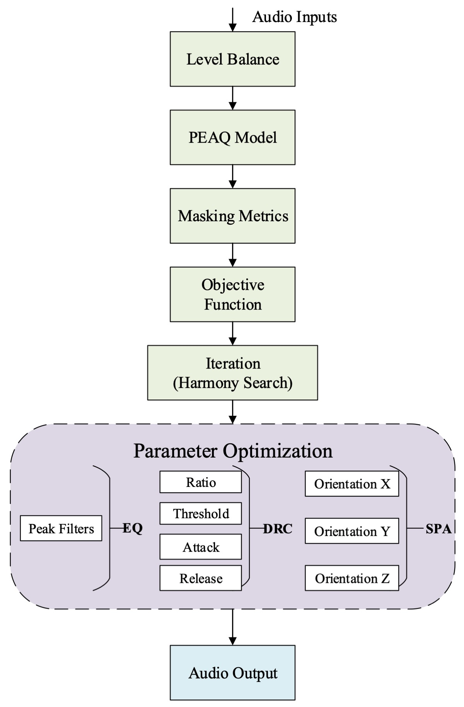

# 🎧 Automatic Mixing Speech Enhancement System

This project provides an **automatic mixing and speech enhancement system** designed to reduce auditory masking in multi-speaker scenarios. The system intelligently processes multiple tracks of speech audio, enhancing clarity and separation using perceptually motivated optimization techniques.

---

## 🧠 System Overview

When multiple people speak simultaneously, **auditory masking** and signal interference often make it difficult to distinguish individual voices. This system addresses that problem by:

- Evaluating perceptual masking with the **PEAQ model** (ITU-R BS.1387)  
- Using **Ideal Mask Ratio (IMR)** metrics for precise optimization  
- Applying audio effects including:
  - 🎚️ Level balancing  
  - 🎛️ Equalization  
  - 📉 Dynamic range compression  
  - 🧭 Spatialization  
- Using a **hybrid optimization approach**:
  - 🎵 Harmony Search (metaheuristic)  
  - 🔢 Integer optimization




<!-- ---

## 📜 Abstract

> The simultaneous presence of multiple audio signals can lead to information loss due to auditory masking and interference, often resulting in diminished signal clarity. We propose a speech enhancement system designed to present multiple tracks of speech information with reduced auditory masking, thereby enabling more effective discernment of multiple simultaneous talkers. The system evaluates auditory masking using the ITU-R BS.1387 Perceptual Evaluation of Audio Quality (PEAQ) model along with ideal mask ratio metrics. To achieve optimal results, a combined iterative Harmony Search algorithm and integer optimization are employed, applying audio effects such as level balancing, equalization, dynamic range compression, and spatialization, aimed at minimizing masking. Objective and subjective listening tests demonstrate that the proposed system performs competitively against mixes created by professional sound engineers and surpasses existing auto-mixing systems.

--- -->

## 📦 Installation

1. Open a terminal and navigate to the project directory.
2. Run the following command to install dependencies:

   ```bash
   npm install
   ```

   This will install all packages listed in the `package.json` file.

---

## 🔧 Prerequisites

- **Node.js** must be installed on your system.  
  👉 [Download Node.js](https://nodejs.org/)

- If `http-server` is not already installed, you can install it globally with:

   ```bash
   npm install -g http-server
   ```

---

## 🚀 Running the System

1. Open a terminal and navigate to the project directory.
2. Start the local server:

   ```bash
   http-server
   ```

3. In your browser, go to:

   ```
   http://localhost:8080
   ```

---
## 🎛️ Usage Instructions

⚠️ **You must first click `Play-Automix` to start the system.**  
This step is essential for initializing audio parameter training and optimization. Without this, no enhancement processing will occur.

On the UI page:

- 🔹 **Click `Play-Automix`**:  
  This initializes the system. It begins analyzing audio parameters and performing training and optimization to reduce auditory masking.

- 🔹 **Click `Play-Unmix`**:  
  Listen to the unprocessed (raw) version of the same audio for comparison.

- 🔹 **Click `Stop`**:  
  Ends playback and records the enhanced output.

## License

This code is provided for research purposes only.  
Non-commercial use is permitted.  
Commercial use, redistribution, or modification of this code requires prior written permission.

Please cite the associated paper if you use this code in your work.
